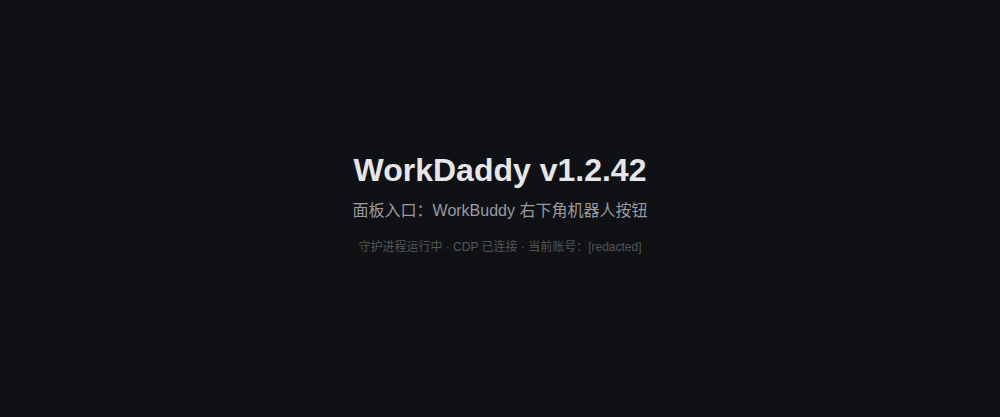
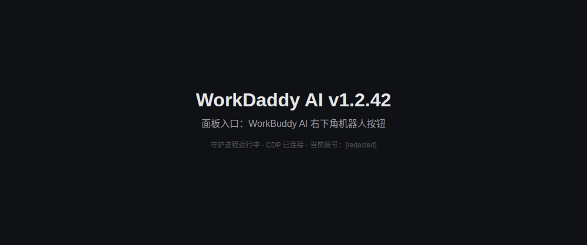
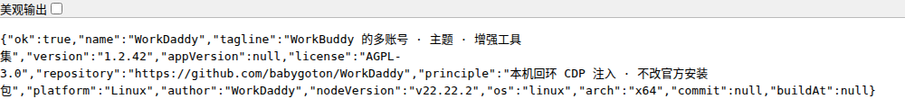

# WorkDaddy on Linux

上游 WorkDaddy 只发布 macOS（`.dmg`）与 Windows（`.exe`）安装包，代码里所有「非 Windows」
分支都按 macOS 处理（`~/Library/Application Support`、`/Applications/*.app`、`launchctl`、
`osascript`）。本仓库已补齐 Linux 支持，**改动只做加法**：macOS / Windows 行为保持不变，
Linux 走新增的显式分支。

已在本机实测的环境：WorkBuddy 5.5.4（Linux 官方包）+ Node 22.22.2 + 78 项内置测试全通过。

---

## 一、Linux 路径对照（已实测确认）

| 用途 | macOS | Windows | Linux |
|---|---|---|---|
| 应用支持根（配置类） | `~/Library/Application Support` | `%APPDATA%` | `$XDG_CONFIG_HOME`（`~/.config`） |
| 扩展数据根（登录凭据所在） | `~/Library/Application Support` | `%LOCALAPPDATA%` | `$XDG_DATA_HOME`（`~/.local/share`） |
| 登录凭据文件 | `<数据根>/CodeBuddyExtension/Data/Public/auth/workbuddy-desktop.info` | 同左 | `~/.local/share/CodeBuddyExtension/Data/Public/auth/workbuddy-desktop.info` |
| 应用可执行文件 | `/Applications/WorkBuddy.app` | `%LOCALAPPDATA%\Programs\WorkBuddy\WorkBuddy.exe` | `/opt/WorkBuddy/workbuddy` |
| 账号数据库 | `~/.workbuddy/workbuddy.db` | 同左 | `~/.workbuddy/workbuddy.db` |
| WorkDaddy 备份目录 | `~/Library/Application Support/WorkDaddy` | `%APPDATA%\WorkDaddy` | `~/.config/WorkDaddy` |

> 登录凭据路径三平台**同构**，只是根不同——这正是 `profiles.js` 一处修正即可全盘生效的原因。

---

## 二、安装

```bash
cd /path/to/WorkDaddy

# 1) 准备数据目录 + 写入客户端配置 + 备份当前登录账号（不启动守护进程）
bash scripts/install-linux.sh --no-start

# 2) 启用 CDP 并重启 WorkBuddy（这一步会关闭 WorkBuddy，请先保存对话）
bash scripts/relaunch-with-cdp-linux.sh
```

第 2 步完成后，WorkBuddy 右下角会出现机器人按钮（WorkDaddy 面板）。

如果只想一条命令走完全程（含启动守护进程）：

```bash
bash scripts/install-linux.sh          # 自动启动守护进程并等待就绪
```

### 常用环境变量

| 变量 | 说明 |
|---|---|
| `WBSWITCH_PROFILE` | 客户端 profile，默认 `workbuddy-cn`（另有 `workbuddy-ai` / `codebuddy-cn` / `codebuddy-intl`） |
| `WBSWITCH_DATA_DIR` | 备份数据目录 |
| `WBSWITCH_PORT` | Web 状态页端口（默认 47832） |
| `WBSWITCH_CDP_PORT` | 指定 CDP 端口 |
| `WBSWITCH_WORKBUDDY_BIN` | 显式指定 WorkBuddy 可执行文件 |
| `WBSWITCH_WORKBUDDY_LAUNCHER` | 显式指定启动器脚本（默认自动探测 `~/.local/bin/workbuddy-noproxy`） |

### 强制使用真实二进制直启

若你的启动器吞掉了参数、导致 CDP 起不来：

```bash
WBSWITCH_WORKBUDDY_LAUNCHER= bash scripts/relaunch-with-cdp-linux.sh --yes
```

---

## 三、开机自启（可选）

上游 macOS 版故意不做登录自启（多 profile 会互相干扰），Linux 默认同样不装。
确实需要常驻时：

```bash
bash scripts/systemd-install-linux.sh          # 安装并启动 systemd --user 服务
systemctl --user status workdaddy-workbuddy-cn
bash scripts/systemd-install-linux.sh --remove  # 卸载
```

---

## 四、卸载

```bash
bash scripts/uninstall-linux.sh          # 仅停止守护进程，保留账号备份
bash scripts/uninstall-linux.sh --purge  # 连同备份一起移除（走回收站）
```

---

## 五、海外版 WorkBuddy AI（隔离 HOME / 独立应用副本）

海外版与国内版的关键差异：它跑在**隔离 HOME** 下——独立应用副本、独立配置目录、独立登录态。
WorkDaddy 的守护进程必须运行在**同一个 HOME** 里，否则会读到国内版的登录态、数据根也会指错。

已实测确认的海外版布局（与国内版完全不同）：

| 项 | 路径 |
|---|---|
| 隔离 HOME | `~/.workbuddy-ai-home` |
| 应用可执行文件 | `~/.local/share/workbuddy-ai/app/workbuddy` |
| 配置 / 数据根 | `<隔离HOME>/.config/workbuddy-ai`（**不是** `~/.workbuddy-ai`） |
| 登录凭据 | `<隔离HOME>/.local/share/CodeBuddyExtension/Data/Public/auth/workbuddy-desktop-ai.info` |
| 数据库 | `<隔离HOME>/.config/workbuddy-ai/workbuddy.db` |
| 启动器 | `~/.local/bin/workbuddy-ai` |

数据根之所以不是 `~/.workbuddy-ai`，是因为海外版用 `WORKBUDDY_CONFIG_DIR` /
`--user-data-dir` 把 Electron 的 userData 重定向了。WorkDaddy 会按「哪个候选目录里
真的有 `workbuddy.db`」自动探测，不需要你手填。

### 一键脚本

```bash
# 1) 安装（自动从你的启动器解析出隔离 HOME、应用副本、数据根）
bash scripts/workbuddy-ai-linux.sh install

# 2) 启用 CDP 并重启 WorkBuddy AI（会关闭它，请先保存对话）
bash scripts/workbuddy-ai-linux.sh relaunch

# 其他
bash scripts/workbuddy-ai-linux.sh status      # 查看解析到的路径与存在性检查
bash scripts/workbuddy-ai-linux.sh uninstall   # 卸载（保留备份）
```

`status` 会打印所有关键路径并逐个做存在性检查，路径不对时一眼能看出来：

```
  登录用户真实家目录 : /home/user
  隔离 HOME          : /home/user/.workbuddy-ai-home
  应用可执行文件     : /home/user/.local/share/workbuddy-ai/app/workbuddy
  配置/数据目录      : /home/user/.workbuddy-ai-home/.config/workbuddy-ai

存在性检查：
  ✓ /home/user/.local/share/workbuddy-ai/app/workbuddy
  ✓ /home/user/.workbuddy-ai-home/.config/workbuddy-ai/workbuddy.db
  ✓ .../auth/workbuddy-desktop-ai.info
```

### 为什么需要这个封装脚本

如果你手工 `HOME=... WBSWITCH_PROFILE=workbuddy-ai bash scripts/install-linux.sh`，
有两个坑：

1. **隔离 HOME 下没有托管 node runtime**，`$HOME/.workbuddy/binaries/...` 找不到，
   脚本已改为回退「登录用户真实家目录」+ `PATH`。
2. **环境里可能残留国内版的 `WORKBUDDY_CONFIG_DIR`**（从 WorkBuddy 内置终端启动时尤其常见），
   会导致海外版的数据根被指到 `~/.workbuddy`（国内版目录）。代码已按 profile 名做了
   兄弟端互斥过滤，封装脚本还会显式传入 `WBSWITCH_TARGET_DATA_ROOT` 兜底。

封装脚本只做一件事：把环境设正确，然后转交给通用脚本。想手工控制时用这些变量覆盖：

| 变量 | 说明 |
|---|---|
| `WBSWITCH_AI_LAUNCHER` | 启动器路径（默认 `~/.local/bin/workbuddy-ai`） |
| `WBSWITCH_AI_HOME` | 隔离 HOME |
| `WBSWITCH_AI_BIN` | 应用可执行文件 |
| `WBSWITCH_AI_CONFIG` | 配置/数据目录 |

### 两端可以同时运行

国内版与海外版是两个独立客户端、独立守护进程、独立端口，互不干扰：

| | 国内版 | 海外版 |
|---|---|---|
| profile | `workbuddy-cn` | `workbuddy-ai` |
| UI 端口 | 47832 | 47833 |
| CDP 端口 | 9222 | 9223 |
| 备份目录 | `~/.config/WorkDaddy` | `<隔离HOME>/.config/WorkDaddy/profiles/workbuddy-ai` |

需要常驻时分别装 systemd 服务（服务名带 profile 后缀，不会互相覆盖）：

```bash
bash scripts/systemd-install-linux.sh                        # 国内版
HOME=<隔离HOME> WBSWITCH_PROFILE=workbuddy-ai \
  bash scripts/systemd-install-linux.sh                      # 海外版
```

---

## 六、Linux 适配到底改了哪些地方

### 新增文件

| 文件 | 作用 |
|---|---|
| `scripts/platform.js` | 三平台常量与路径解析的唯一来源（XDG、扩展数据根、Linux 可执行文件候选、数据根探测、兄弟端互斥、启动器真实家目录反推） |
| `scripts/install-linux.sh` | Linux 安装脚本 |
| `scripts/relaunch-with-cdp-linux.sh` | 关闭并以 `--remote-debugging-port` 重启 WorkBuddy；另提供 `--status`（只读探测）与 `--ensure`（已开面板则不重启应用） |
| `scripts/uninstall-linux.sh` | Linux 卸载脚本 |
| `scripts/systemd-install-linux.sh` | 生成并安装 systemd --user 服务 |
| `scripts/workbuddy-ai-linux.sh` | 海外版一键封装（install / relaunch / uninstall / status / probe） |
| `scripts/launch-gui-linux.sh` | 图形启动器（zenity 选择渠道）；也支持 `cn/ai/both/services/info` 直接指定 |
| `scripts/install-desktop-linux.sh` | 生成桌面图标与应用菜单项（`--remove` 可卸载） |
| `LINUX.md` | 本文档 |

### 修改文件

| 文件 | 改动 |
|---|---|
| `scripts/profiles.js` | 引入 `platform.js`；`appSupport` / `localSupport` 增加 Linux（XDG）分支；`appPath` 在 Linux 下解析真实可执行文件 |
| `scripts/lib.js` | 备份目录走 `$XDG_CONFIG_HOME`；`osascript` 回退改为仅 macOS 使用（Linux 直写失败即如实报错）；macOS 专属的 HelloBuddy 旧目录迁移在非 macOS 平台短路 |
| `scripts/daemon.js` | 拆出 `IS_MAC` / `IS_LINUX`；`WORKBUDDY_BINARY` 不再拼 `/Contents/MacOS/Electron`；新增 `/proc` 精确进程枚举（`linuxWorkBuddyPids`）替代 `pgrep -f` 正则匹配；退出应用改用 `SIGTERM → SIGKILL`；重启优先走**启动器并还原真实 HOME**（保留 `--user-data-dir` 与 MIME 关联）；**CDP 端口识别增加 Linux 强信号兜底**；自动更新在 Linux 短路 |
| `scripts/workbuddy-target.js` | 新增 Linux 目标构造分支；官方包走 `official`（数据源用 profile 默认值），海外版/企业版走 `enterprise` 并**自动探测真实数据根**（按 `workbuddy.db` 定位）+ 登录凭据按 profile 选名；`.exe` 结尾路径仍走通用分支（不破坏跨平台目标） |
| `scripts/cdp-targets.js` | 新增 Linux 应用路径信号（`/opt/WorkBuddy/`、`workbuddy-ai/`） |
| `scripts/sentry-report.js` | 共享数据目录改由 `platform.js` 推导。原先非 Windows 一律按 macOS 处理，会在 Linux 家目录下凭空创建 `~/Library/Application Support/WorkDaddy`（真机实测到，两端都有） |
| `scripts/build-mac-dmg.sh` | 打包清单补上 `platform.js` |
| `test/auth-discovery.test.js` | 测试夹具改为平台自适应；macOS 专属的 HelloBuddy 用例在非 macOS 跳过 |

### 两个 Linux 特有的坑（已在代码里处理）

1. **CDP 端口识别**：Chromium/Electron 的 `/json/version` 里 `Browser` 字段固定是
   `Chrome/xxx`，应用名只在 `User-Agent` 里、且部分打包方式会省略。原逻辑仅凭该字符串
   判断归属，Linux 上有识别不到的风险。现在额外接受「页面来自当前 profile 可执行文件
   所在目录」这一强信号。

2. **系统代理劫持回环**：本机常设 `http_proxy`（Xray/Clash 等），会让 `127.0.0.1` 的
   健康检查与 CDP 请求被代理拦截，表现为「守护进程未就绪」。脚本里所有回环探测均带
   `--noproxy '*'`，systemd 服务显式设置 `NO_PROXY`。

---

## 七、当前状态与限制

**已实测通过（国内版 + 海外版两端都验过）：**

- 账号备份与读取：国内版读到 3 个账号，海外版读到 1 个账号。
- 会话库读取：两端都能列出真实会话（证明数据库路径正确）。
- 守护进程启动、Web 状态页、`/api/accounts`、`/api/sessions`、`/api/models`、
  `/api/token-stats` 均正常。
- CDP 端点识别：桩服务验证过；双实例归属判定有专门的回归用例。
- 实际面板注入：在真实 Linux 桌面会话上验证通过 —— 两端守护进程各自连上对应
  WorkBuddy 实例的 CDP 端点并完成注入（日志确认 `root=true widget=true`）。
- 全量测试（合并上游 1.2.42 后）：780 项，768 通过 / 3 失败 / 9 跳过。
  3 项失败均由运行环境的内存限制引起（`WebAssembly.instantiate(): Out of memory`），
  在同一环境下跑上游原版代码同样失败，与本次改动无关。

### 实测截图

两端守护进程同时运行，各占独立端口（国内版 47832 / 海外版 47833），互不干扰：

| 国内版 | 海外版（隔离 HOME） |
|---|---|
|  |  |

守护进程自报的平台信息 —— `os` 为 `linux`、Node 为 `v22.22.2`、版本 `1.2.42`：



> 截图中「当前账号」一项已遮蔽为 `[redacted]`，其余内容为原始输出。

**已知限制：**

- 面板内「检查更新」在 Linux 下会提示不支持（上游无 Linux 发布包），更新请 `git pull`。
- 海外版的 `models.json` 在本机不存在，属正常（该端未使用模型配置文件）。

---

## 八、桌面图标 / 图形启动器

一键生成桌面图标与菜单项，双击即可选择启动哪个渠道，不用敲命令：

```bash
bash scripts/install-desktop-linux.sh                   # 默认：只装 1 个入口
bash scripts/install-desktop-linux.sh --with-shortcuts  # 额外加 3 个直达菜单项
bash scripts/install-desktop-linux.sh --remove          # 移除全部入口
```

默认只装 **1 个**入口，保持干净：

| 位置 | 名称 | 行为 |
|---|---|---|
| 桌面 + 应用菜单 | `WorkDaddy 启动器` | 弹出选择框：国内版 / 国际版 / 两个都启动 / 仅后台服务 / 状态页 |

加 `--with-shortcuts` 会额外在**应用菜单**（不放桌面）装 3 个直达项，便于固定到收藏栏：
`WorkDaddy · 国内版` / `WorkDaddy · 国际版` / `WorkDaddy · 仅后台服务`。

### 设计要点

- **已经在跑的面板不会被打断**。启动器先做只读探测，若该渠道的面板（CDP）已经开启，
  就只确保后台服务，**完全不碰应用窗口**；只有「应用在跑但没开面板」时才需要重启，
  并且会先弹窗征求同意（避免你正在聊天时被关掉）。
- **逻辑全部复用已有脚本**（`relaunch-with-cdp-linux.sh --ensure` 等），
  端口分配、归属判定、启动器还原真实 HOME 这些坑不在 GUI 层重实现一遍。
- **无图形会话自动退化**：检测不到 `DISPLAY`/`WAYLAND_DISPLAY` 时不硬用 zenity
  （否则只会得到 `This option is not available` 这种费解的报错），改用文本菜单。
  想在终端里看状态也可以直接跑 `bash scripts/launch-gui-linux.sh`。
- 桌面图标会自动 `chmod +x` 并 `gio set metadata::trusted true`。
  若你的桌面环境仍拦截，右键选一次「允许启动」即可。

### 命令行等价用法

```bash
bash scripts/launch-gui-linux.sh              # 弹选择框
bash scripts/launch-gui-linux.sh cn           # 直接国内版
bash scripts/launch-gui-linux.sh ai           # 直接国际版
bash scripts/launch-gui-linux.sh both         # 两个都启动
bash scripts/launch-gui-linux.sh services     # 只起后台服务
bash scripts/launch-gui-linux.sh info         # 打开状态页
```

---

## 九、双实例故障排查（CN + AI 同时装）

两端是同一份构建的两个副本，可执行文件**同名**（都叫 `workbuddy`），
`/json/version` 的 `User-Agent` 也都含 `WorkBuddy/5.5.4`。
因此**不能靠应用名判断"这个 CDP 端口是谁的"**，必须用应用安装目录区分：

| | 安装目录（归属标记） | 默认 CDP 端口 |
|---|---|---|
| 国内版 | `/opt/WorkBuddy` | 9222 |
| 海外版 | `~/.local/share/workbuddy-ai/app` | 9223 |

### 典型症状与原因

| 症状 | 原因 | 处理 |
|---|---|---|
| `curl -X POST :47833/api/inject` 报 `目标页面 workbuddy-cn 不属于当前 profile workbuddy-ai` | 海外版守护进程连到了国内版的页面 | 已修复（`targetHints` 不再用裸应用名）。若仍出现，`--refresh-target` 后重跑 relaunch |
| 两个守护进程的 `/api/status` 都显示 `connected:true` 且 **端口相同** | 端口被兄弟端占用后又被误复用 | 已修复（按安装目录判定归属）。重跑两端 relaunch |
| 每跑一次 relaunch 端口就 +1（9223→9224→9225） | 只按 `/json/version` 判断"是否已有 CDP"，无法区分实例，于是每次都以为端口被占 | 已修复（改为按安装目录复用） |
| 注入的面板出现两个 / 面板错乱 | 两个守护进程曾往同一个应用注入过 | 在 WorkBuddy 窗口按 `Ctrl+R` 重载，或重启该实例 |
| **切换账号后点登录，浏览器打开的是 ChatGPT 之类的错误应用** | 隔离 HOME 下 `xdg-open` 找不到用户级 MIME 关联，回退到系统兜底（`/usr/share/applications/chatgpt.desktop` 也注册了 `x-scheme-handler/https`） | 见下方「xdg-open 关联」小节 |

### xdg-open 关联被破坏（打开 ChatGPT 的原因）

海外版以隔离 HOME 运行，而 `xdg-open` 是按 `$HOME` / `$XDG_CONFIG_HOME` 找
`mimeapps.list` 的。用户自己的启动器会把真实关联软链进隔离 HOME：

```
<隔离HOME>/.config/mimeapps.list -> <真实HOME>/.config/mimeapps.list
```

问题在于启动器用 `REAL_HOME="${HOME:-…}"` 反推真实家目录。**若调用方带着
`HOME=<隔离HOME>` 去启动它**（早期版本的 relaunch 脚本就是这么干的），
`REAL_HOME` 会等于隔离 HOME，于是：

1. `ln -sfn` 把软链**覆盖成指向自己的死链**，用户级关联整体失效；
2. 启动器还会把 `XDG_CONFIG_HOME` 设成 `<隔离HOME>/.config`，而那里的软链正是坏的；
3. 两级都读不到 → 回退系统兜底 → `https` 交给 `chatgpt.desktop`。

**修复**（三处，缺一不可）：

1. relaunch / daemon 启动应用时，**必须把 HOME 还原成真实家目录**再调启动器
   （见 `launcherHomeFor`；真实家目录也可用 `WBSWITCH_LAUNCH_HOME` 显式指定）。
2. 给启动器加防御：`REAL_HOME == ISOHOME` 时跳过并顺手修掉自指死链。
3. 已经产生死链时的现场修复：

```bash
ISO=~/.workbuddy-ai-home
rm -f "$ISO/.config/mimeapps.list"
ln -sfn "$HOME/.config/mimeapps.list" "$ISO/.config/mimeapps.list"
# 验证
HOME="$ISO" XDG_CONFIG_HOME="$ISO/.config" xdg-mime query default x-scheme-handler/https
# 期望输出 google-chrome.desktop（而不是 chatgpt.desktop）
```

> `xdg-open` 每次调用都会重新读取关联，所以修好软链后**不需要重启 WorkBuddy**
> 即刻生效；但要让它用上「走启动器 + 还原 HOME」的新逻辑，仍需重启守护进程。


### 自查命令

```bash
# 每个 CDP 端点到底属于谁
for p in 9222 9223 9224 9225; do
  echo "--- $p ---"
  curl -s --noproxy '*' -m 2 "http://127.0.0.1:$p/json/list" \
    | grep -o '"url": *"file://[^"]*"' | head -1
done

# 两个守护进程各自连到了哪个端口
for p in 47832 47833; do
  echo -n "$p: "
  curl -s --noproxy '*' -m 2 "http://127.0.0.1:$p/api/status" \
    | grep -o '"cdp":{[^}]*}'
done
```

**正确状态**：47832（CN）与 47833（AI）报告的 `port` 应当**不同**，
且分别对应各自应用的安装目录。若两者端口相同，就是连串了。

### 遇到连串时的恢复步骤

```bash
# 1) 刷新两端客户端配置（重新探测安装目录与数据根）
cd /path/to/WorkDaddy
bash scripts/install-linux.sh --no-start --refresh-target
bash scripts/workbuddy-ai-linux.sh install --no-start --refresh-target

# 2) 重启海外版（会自动停掉旧守护进程、按新端口重启）
bash scripts/workbuddy-ai-linux.sh relaunch

# 3) 国内版若面板异常，按 Ctrl+R 重载窗口即可
```


**已实测通过（国内版 + 海外版两端都验过）：**

- 账号备份与读取：国内版读到 2 个账号，海外版读到 1 个账号。
- 会话库读取：两端都能列出真实会话（证明数据库路径正确）。
- 守护进程启动、Web 状态页、`/api/accounts`、`/api/sessions` 均正常。
- 全部内置测试 618 项：609 通过 / 0 失败 / 9 跳过（跳过项全部是平台门控）。
- CDP 端点识别：用桩服务验证过——`/json/version` 不含 WorkBuddy 字样时仍能正确识别。

**仍需在你的桌面会话执行才能验证：**

- `--remote-debugging-port` 重启与实际面板注入。这是唯一无法在沙箱内验证的环节
  （沙箱与宿主进程不在同一命名空间，碰不到 WorkBuddy 进程）。

**已知限制：**

- 面板内「检查更新」在 Linux 下会提示不支持（上游无 Linux 发布包），更新请 `git pull`。
- 海外版的 `models.json` 在本机不存在，属正常（该端未使用模型配置文件）。
