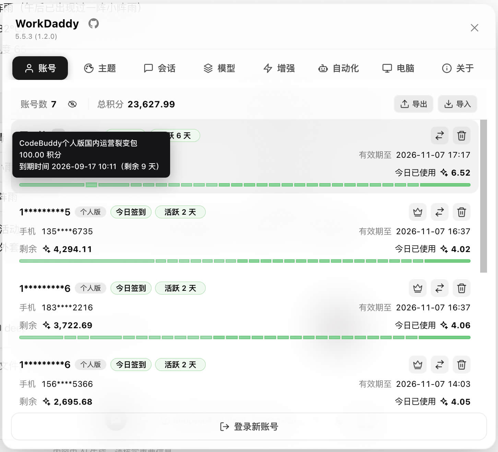
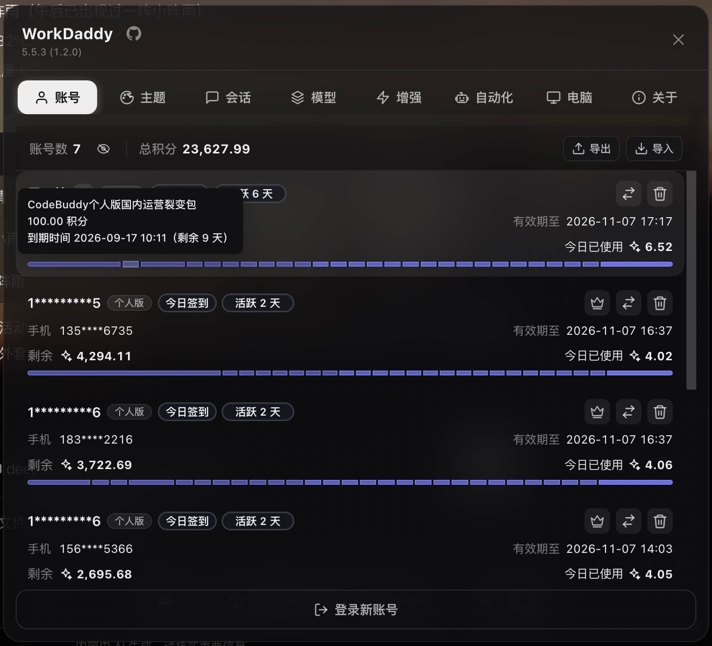
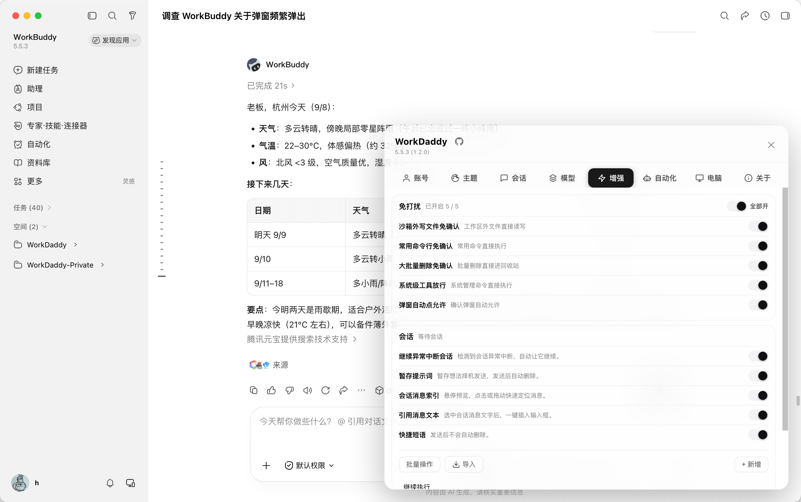
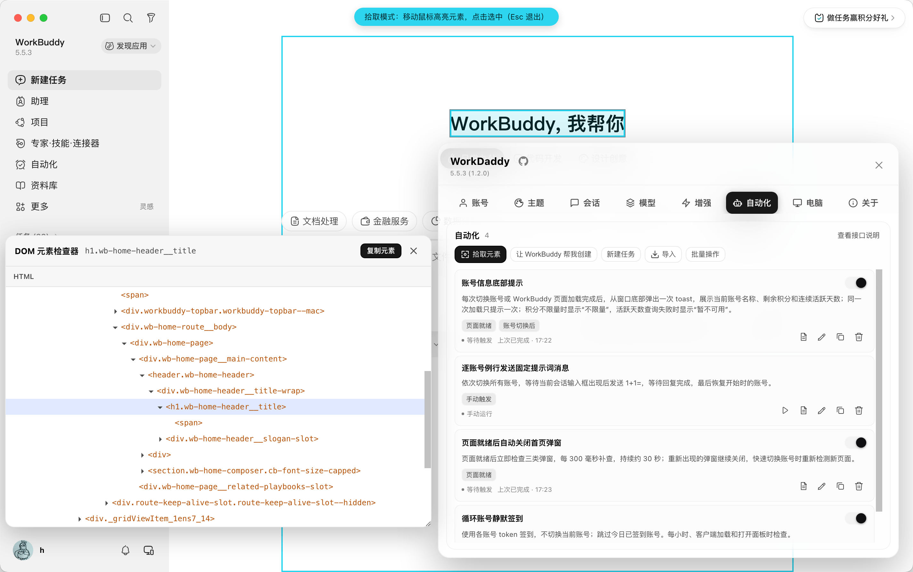
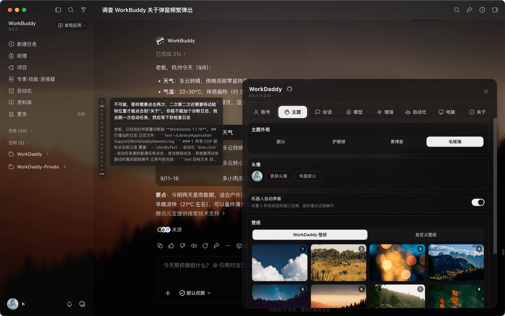

# WorkDaddy

**Language:** [简体中文](README.md) · [English](README_en.md)

> **WorkDaddy enhances the WorkBuddy desktop app: keep separate account backups and switch with a click; run unattended AI tasks with quiet approval mode; migrate sessions between accounts and resume interrupted tasks; run automations on events or schedules; stash prompts, send quick phrases, and customize frosted-glass themes. Accounts and configuration stay on your computer.**
> Local loopback CDP injection · the official installation is never modified.

A desktop enhancement tool for [WorkBuddy](https://www.workbuddy.cn/) and [WorkBuddy AI](https://www.workbuddy.ai/), built on **Chrome DevTools Protocol (CDP)**.
It injects UI components into the running WorkBuddy renderer without patching or re-signing the official app.


---

## Preview








---

## What it does

- **Fast account switching:** each WorkBuddy account has a separate backup, so you can switch without scanning a QR code every time.
- **Add an account without quitting:** authorize through OAuth in your browser while WorkBuddy stays open. The new account joins the list automatically. A traditional soft logout flow is also available.
- **Encrypted account import/export:** move account backups between computers using a password-protected file.
- **Daily credits:** automation tasks manage daily check-ins across accounts and cache completed results without interrupting your work.
- **Automation tasks:** describe what you need and let WorkBuddy create a task, or edit the steps yourself. Supports manual, event, and scheduled triggers, run logs, stopping tasks, and JSON / ZIP import/export.
- **Quiet approval mode:** automatically handle supported permission prompts while you are away.
- **Stash prompts:** send drafts to WorkBuddy's pending message queue while preserving images, files, and quotes for later use.
- **Themes:** use the built-in frosted-glass theme, preset wallpapers, or your own backgrounds.
- **Session migration:** copy sessions between accounts automatically or manually and continue working where you left off.
- **Model tools:** manage and switch models more easily, including multiple configurations with the same model name.
- **Sleep control:** keep the computer awake while AI tasks run, then allow normal sleep when they finish.
- **Auto-continue:** automatically continue tasks interrupted by network fluctuations, timeouts, or similar failures.
- **Quick phrases:** save common prompts in the panel and send them from the composer toolbar.

---

## Installation

- For the mainland [WorkBuddy](https://www.workbuddy.cn/) client, download **WorkDaddy**.
- For the international [WorkBuddy AI](https://www.workbuddy.ai/) client, download **WorkDaddy AI**.

### macOS

1. Download the latest `WorkDaddy-x.y.z.dmg` or `WorkDaddy-AI-x.y.z.dmg` from [Releases](../../releases).
2. Open the DMG and drag the app into **Applications**.
3. If macOS says Apple cannot check the app for malicious software:
   1. Open **System Settings → Privacy & Security**.
   2. Find the blocked WorkDaddy app and choose **Open Anyway**.
   3. Confirm with your login password.
   
4. Launch the app. It starts its local daemon and injects the panel into WorkBuddy.
5. Once the robot button appears, you are ready to go.

#### Enterprise / VPC clients

On macOS, WorkDaddy scans apps whose names start with `WorkBuddy` and that contain `Contents/MacOS/Electron`, such as `WorkBuddy企业定制版.app`. It filters candidates by the WorkDaddy or WorkDaddy AI profile. If several clients match, a system picker lets you choose one and remembers your selection. No manual configuration file lookup is needed. For an app with a completely custom name, run this advanced configuration command from the source directory:

```bash
node scripts/workbuddy-target.js --configure --platform darwin \
  --profile workbuddy-cn \
  --binary "/Applications/Enterprise Client.app/Contents/MacOS/Electron" \
  --data-dir "$HOME/Library/Application Support/WorkDaddy"
```

### Windows

1. Download `WorkDaddy-Setup-x.y.z.exe` or `WorkDaddy-AI-Setup-x.y.z.exe` for your client from [Releases](../../releases).
2. Run the installer.
3. Launch **WorkDaddy** or **WorkDaddy AI** from the desktop shortcut.

#### Enterprise / VPC clients

Install the WorkDaddy or WorkDaddy AI edition that most closely matches your client's interface. The installer detects the corresponding official client and shows its path and version. Enterprise users can choose **Browse** to select their own `.exe`; no configuration files or environment variables need to be edited.

The selection is saved in WorkDaddy's personal data directory and preserved during updates. Run the installer again to change it or return to the detected official client. WorkDaddy pins the selected client version, so use the installer to confirm the client again after it is upgraded or moved.

### Run from source (developers)

```bash
git clone https://github.com/babygoton/WorkDaddy.git
cd WorkDaddy
bash scripts/install.sh           # Create the backup directory and start the daemon
bash scripts/relaunch-with-cdp.sh  # Launch WorkBuddy with CDP on port 9222
```

WorkBuddy and WorkBuddy AI share the same daemon code. Profiles bind it to the intended client rather than guessing from the first available CDP port:

```bash
WBSWITCH_PROFILE=workbuddy-cn bash scripts/relaunch-with-cdp.sh
WBSWITCH_PROFILE=workbuddy-ai bash scripts/relaunch-with-cdp.sh
```

Prompt stashing and themes are enabled for both WorkBuddy profiles. CodeBuddy profile support is on hold and is outside the current release scope.

The release scripts produce four packages for the two WorkBuddy clients: `WorkDaddy-<version>.dmg`, `WorkDaddy-AI-<version>.dmg`, `WorkDaddy-Setup-<version>.exe`, and `WorkDaddy-AI-Setup-<version>.exe`. For macOS builds, set `WORKDADDY_BUILD_PROFILE=workbuddy-cn` or `workbuddy-ai` to build only one client. Windows ZIPs are temporary installer build inputs, not release downloads.

`install.sh`:

- Creates the backup directory at `~/Library/Application Support/WorkDaddy`.
- Migrates legacy backups from `~/Library/Application Support/HelloBuddy/accounts` on first launch, preserving the old directory.
- Backs up the currently signed-in WorkBuddy account.
- Removes old launchd registrations and starts the daemon manually; it no longer starts automatically at login.
- Starts the background daemon immediately.
- Opens the management interface at `http://127.0.0.1:47832`.

> The installer starts the daemon once. After that, launch the appropriate WorkDaddy app when you need it.

---

## How it works

**CDP injection · the official installation is never modified**

```text
┌─────────────┐  --remote-debugging-port=9222  ┌──────────────┐
│  WorkBuddy  │ <───────────────────────────> │  WorkDaddy   │
│  (Electron) │       Chrome DevTools         │  daemon.js   │
│             │       Protocol (CDP)         │              │
│  Renderer   │  ←── Runtime.evaluate ────    │  HTTP :47832 │
│  Bottom     │      inject.js               │  Local API   │
│  right      │                              │              │
└─────────────┘                              └──────────────┘
```

1. **Unmodified WorkBuddy binaries:** the launcher adds `--remote-debugging-port=9222` when starting WorkBuddy. Its binary and signature remain intact.
2. **CDP connection:** the daemon watches login and authentication network events, with a file watcher as a fallback. Login and token refresh events back up the current account to a stable local directory using `account.uid`.
3. **Injected UI:** `Runtime.evaluate` runs `inject.js` in the renderer, adding the robot button and the Accounts, Theme, Sessions, Models, Enhance, Automation, Computer, About, and Settings pages.
4. **Local HTTP API:** the daemon listens on `127.0.0.1:47832`. The panel uses it for account switching, themes, check-ins, permission prompts, sleep control, and other features.
5. **Data boundaries:** account backups and configuration stay local. Login and credit features call WorkBuddy's official APIs; update checks call GitHub Releases. Explicit model connectivity tests send requests and the corresponding API key to the model service you configured. Redacted error diagnostics are enabled by default and can be turned off in **About**.

> Why CDP instead of an official plugin system? It connects directly to the running app, detects authentication changes, and injects the panel and style patches. WorkBuddy updates generally remain compatible as long as its interface does not change substantially.

---

## Usage

### Panel

Click the robot button in the lower-right corner of WorkBuddy and choose a tab:

| Tab | Purpose |
| --- | --- |
| **Accounts** | View account counts, credits, check-ins, and login status; switch, delete, or add accounts; import/export encrypted backups |
| **Theme** | Switch between the default and WorkDaddy themes, choose or upload wallpapers, change avatars, and adjust blur and background overlays |
| **Sessions** | Filter by account and date, copy or delete in bulk, and configure automatic session or workspace copying when switching accounts |
| **Models** | Manage current and alternative models, including backups, copying, editing, enabling, connectivity tests, and bulk deletion |
| **Enhance** | Configure quiet approvals, auto-continue, prompt stashing, and quick phrases |
| **Automation** | Create and manage tasks, configure event or scheduled triggers, inspect run logs, stop running tasks, and import/export JSON or ZIP files |
| **Computer** | Allow or prevent sleep, or restore normal sleep after all AI tasks finish |
| **About** | View version and project information, check for and install updates, and control redacted error diagnostics |
| **Settings** | Choose Chinese or English; the first launch follows the system language and falls back to English |

**Composer tools:** enable **Stash prompts** and **Quick phrases** separately in **Enhance** to show their composer toolbar buttons. Stashing adds the current draft to WorkBuddy's own message queue with text, images, files, and quotes **preserved**, and pauses automatic sending. The composer is then cleared. Queued content is kept per conversation and can be sent, edited, or deleted. Quick phrases can be created, edited, and managed in bulk in Enhance, then sent from the composer toolbar; sending does not delete them.

### Automation

Save repetitive actions as tasks: daily check-ins, account credit queries, conditional reminders, or sending a message in a specific conversation and waiting for a reply.

1. Open **Automation** and use **Quick create** to choose an example, or **Create with WorkBuddy** to describe what you need. WorkBuddy generates the task in a new conversation and adds it to the list when finished. You can also use **New task** to edit the step JSON yourself; **View capabilities** lists the currently supported operations.
2. Choose a trigger: run manually, or respond to events such as client loading, panel opening, page readiness, and account switching. Schedules support intervals, daily, weekly, monthly, and a specific date and time.
3. Enable, disable, edit, or copy tasks from the list. Manual tasks can run immediately; event and scheduled tasks run according to their configuration. Stop a running task when needed and inspect **Run logs** for results and failed steps.

**Import and export:** choose **Import**, select a JSON or ZIP file, preview it, and select the tasks to import. Imported tasks remain disabled, existing tasks with the same ID are not overwritten, and incompatible tasks show the reason. Use bulk actions to select tasks for export: one task produces a JSON file, while multiple tasks produce a ZIP for backup or sharing.

Task definitions are stored locally and executed by the WorkDaddy daemon. Scheduled and event triggers require the daemon to remain running; steps that interact with a page also require the corresponding WorkBuddy client to be available. Task exports exclude account backups and run logs. Local file import/export is supported; an online task marketplace and automatic task updates are not yet available.

### Move accounts to another computer

Use **Export** and **Import** at the top-right of the Accounts page:

1. On the old computer, open WorkDaddy, choose **Export**, and save the generated `WorkDaddy-账号导出-YYYY-MM-DD.json` file.
2. Transfer it securely to the new computer and install and launch WorkDaddy there.
3. Choose **Import** on the Accounts page and select the file. The restored accounts will be available in the account list.

Current exports use your password, a fresh random salt, and AES-256-GCM encryption. The password is not stored in the export. The encrypted file still contains tokens that can restore login sessions, so protect it like a password and remove unneeded copies after migration. Legacy v1 exports can still be imported.

## Security and privacy

- **Local data first:** account backups, themes, and local configuration are not uploaded in the background. Login and credit features access WorkBuddy's official APIs, and updates access GitHub Releases. Explicit model connectivity tests send requests and the corresponding API key to the third-party model service you configured.
- **Error diagnostics are enabled by default:** the **Send error diagnostics** switch in About controls both remote Sentry error reporting and local redacted renderer logs to help diagnose version and compatibility issues. Reports are redacted and truncated; remote reports exclude accounts, session contents, tokens, and API keys. Turn diagnostics off at any time in About, or use `WORKDADDY_TELEMETRY=0` / `1` as an explicit startup override.

A separate `SECURITY.md` may provide an expanded threat model; when it is not included, this section serves as the privacy and security overview.

---

## License and disclaimer

This project is licensed under the **[GNU Affero General Public License v3.0](LICENSE)** (`SPDX-License-Identifier: AGPL-3.0-or-later`).

- WorkDaddy provides local UI and usability enhancements for the WorkBuddy desktop app and **is not affiliated with WorkBuddy**.
- WorkBuddy, its trademarks, and official assets belong to their respective owners. This project is not officially authorized or endorsed by WorkBuddy.
- Third-party themes, wallpapers, and background images are provided for demonstration; check their rights before commercial use.

---

## Community

[Linux.do](https://linux.do/)
